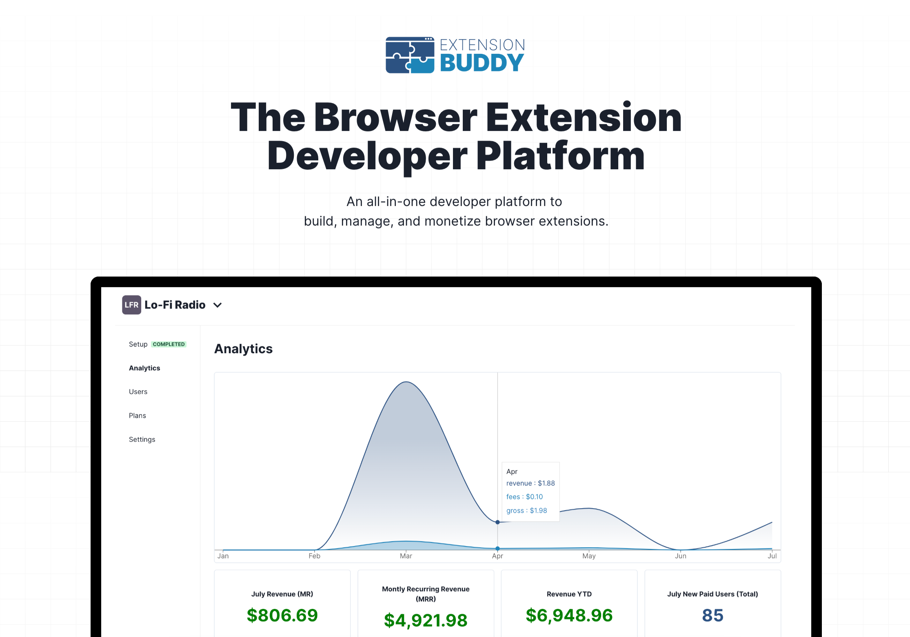

# Extension Buddy SDK

 

## About
[Extension Buddy](https://extensionbuddy.com) is an all-in-one developer plaform to build, manage and monetize your browser extensions. [Extension Buddy Monetize](https://extensionbuddy.com/monetize)  allows you to earn money selling your browser extensions, transforming your innovative ideas into a profitable business. With this SDK, you can: 

- Charge a one-time fee, or offer monthly or annual subscriptions for access to your browser extension.
- Easily access user and subscription plan statuses.
- Restrict access to your extension, ensuring only paid customers can use it.
- Integrate our SDK seamlessly, whether using our npm package or with vanilla JavaScript.
- And much more!

Sign up for [Extension Buddy](https://extensionbuddy.com/signup) (Monetize) to get started!

Learn more by going to https://extensionbuddy.com

## 1. Adding the SDK

To start processing payments, you need to add the Extension Buddy SDK to your browser extension. The SDK facilitates on-demand payment and login windows and manages user states.

**Note**: If you're using an Extension Buddy Template, the SDK is already included, so you can move on to the next steps.

[View Adding the SDK](docs/ADDING_SDK.md)

## 2. Setting up the SDK

Now that the Extension Buddy SDK is integrated into your extension, it's time to set it up for use.

[View Setting up the SDK](docs/SETUP_SDK.md)

## 3. Using the SDK Functions (APIs)

Now that you have connected the Extension Buddy SDK client, it's time to get started. Here are the functions (APIs) available with the SDK.

[View Using the SDK Functions (APIs)](docs/SDK_FUNCTIONS.md)

## License

NOT AVAILIBLE FOR REUSE. PRIVATE. DO NOT COPY OR SELL CODE.

